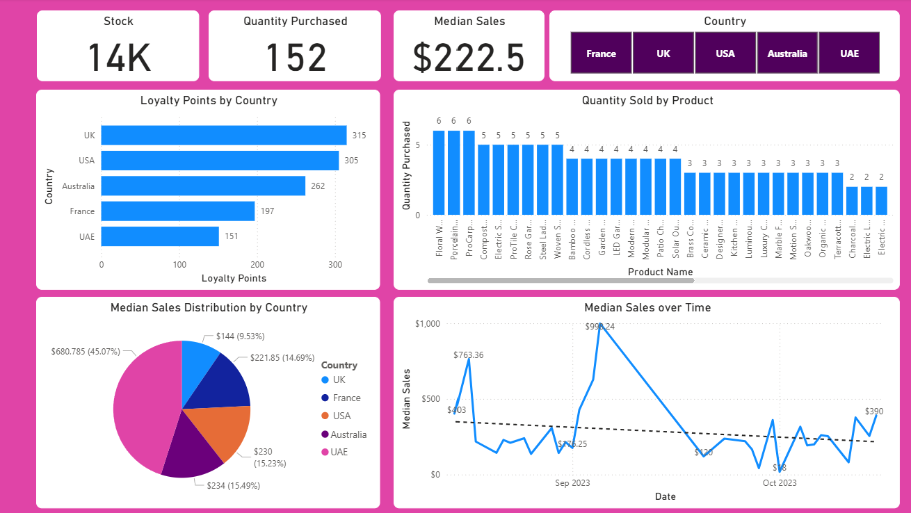
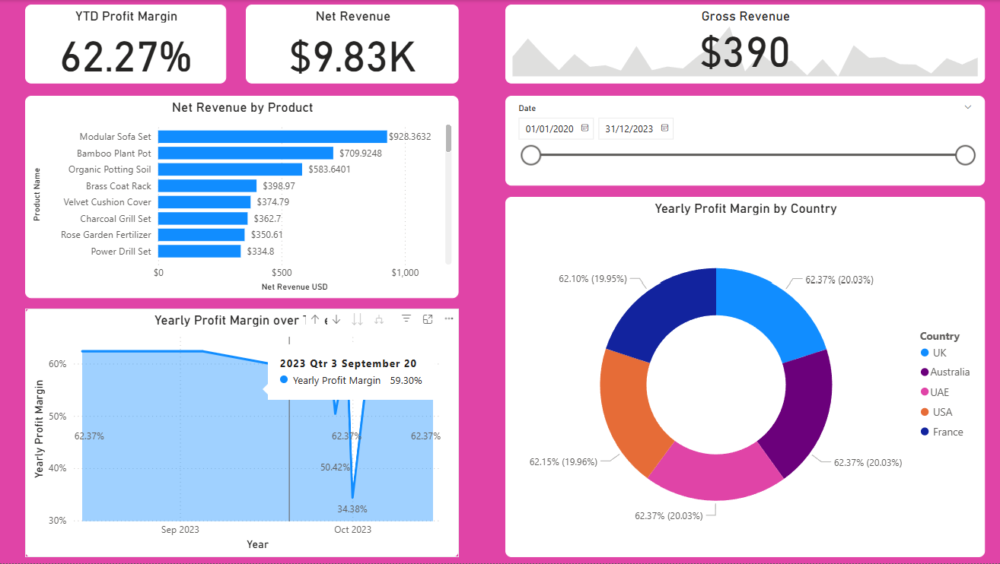

# Microsoft Power BI Specialization Capstone Project
Welcome to my capstone project for the Microsoft Power BI Data Analyst Specliazation. This project served as a culmination of all previous courses in the program, allowing me the opportunity to practice my skills in a real life scenario. Some of these skills included preparing data in Excel, building a data model to match the requirements of the scenario, creating measures/aggregations using the power of Data Analysis Expressions (DAX), and finally, creating captivating, story-telling reports and dasbhoards that deliver actionable insights to stakeholders.

## Setting the stage
We've been hired by Tailwind Traders, a ficticious company, to provide a report displaying an overview of the company's latest sales data, as well as some information pertaining to the company's overall profit. 

## Part 1: Preparing sales data + building the data model
For the first part of the project, we've been given Tailwind Traders' sales data, and are asked to prepare the sales data for analysis. To do this, we included columns detailing the cost per unit, gross revenue, tax payed, net revenue, and profit earned for each sale. Performming this process within Excel allowed us to leverage Excel's intuitive layout and click-and-fill capability to accurately perform these calculations. We then optimized data types, ensuring the Power BI would be able to optimize the data model, both in terms of storage and performance. For example, all currency-related columns were converted to a fixed-decimal number data type to reduce cardinality (aka the number of distinct values within a column when building a relationship), ID-related columns were converted to whole numbers, etc.
 
 
In addition to the Sales table, we were also provided a table of Countries and a table of Purchase data. To perform time-intelligence calculations, a Calendar date table was created using a DAX calculated table expression. Python's versatility was used to create and load a dataset containing exchange rate data into the model, which aided in the creation of the final table, a table containing the Sales table data, but having converted everything to USD.
 
 
Next, the data model was created. This is where relationships were established, ensuring proper cardinality and cross-filter direction between tables. A snapshot of the final data model is provided below.
 
 

 
 

## Part 2: DAX measures + visualization
In this section, DAX was used to create several key measures that would provide a simple high-level overview of performance to executive stakeholders whose technical knowledge is lower than that of an analyst. Measures are great for this type of project, since they are dynamic, recalculated on the fly, and are thus not stored inside the data model. Additionally, two report pages were created: a Sales overview, and a Profit overview, respectively.
 
 

 
 

 
 
The two report pages contain insightful visualizations on top of the high-level metrics, such as loyalty points by country, a pie chart showing proportion of median sales by country, and yearly profit margin as a function of time. Both pages also contain interactive elements in the form of sliders that allow for viewers to engage with the presentation and enhance their understanding.

## Part 3: Dashboard/workspace creation + configuring alerts and subscriptions
In this section, an executive dashboard was created with a mix of visuals from both report pages, to provide executive stakeholders with the low-down on both sales and profit metrics. Alerts were created to immediately notify analysts when a metric were to drop below a certain threshold, e.g. if gross revenue drops below $400 USD. Subscriptions were also set up so that we could receive weekly updates for the Sales and Profit Overview pages, automatically sent to our inbox. This way, we can avoid any manual rechecking of updates, and view them from our mailbox on a weekly basis without any effort.

## Final thoughts
This was a very instructional project, the high-level steps were laid out for us, but it also promoted self-learning at the same time, since a lot of the directions left things up for the reader to decide and figure. For example, one of the instructions in part 2 was "In the formula bar, create a new measure for quarterly profit using the Profit in USD column. You'll need a function that aggregates data until the end of the current quarter, referencing both the profit values and a calendar table". In this way, it is up to us to determine what function will help us best in completing the task at hand. Overall, I thoroughly enjoyed this project, as I got a glimpse into the working of a data analyst, working through their process from end-to-end. It is my hope that this project, and the course itself was able to prepare me to start a career in data analytics. Learning never stops!
